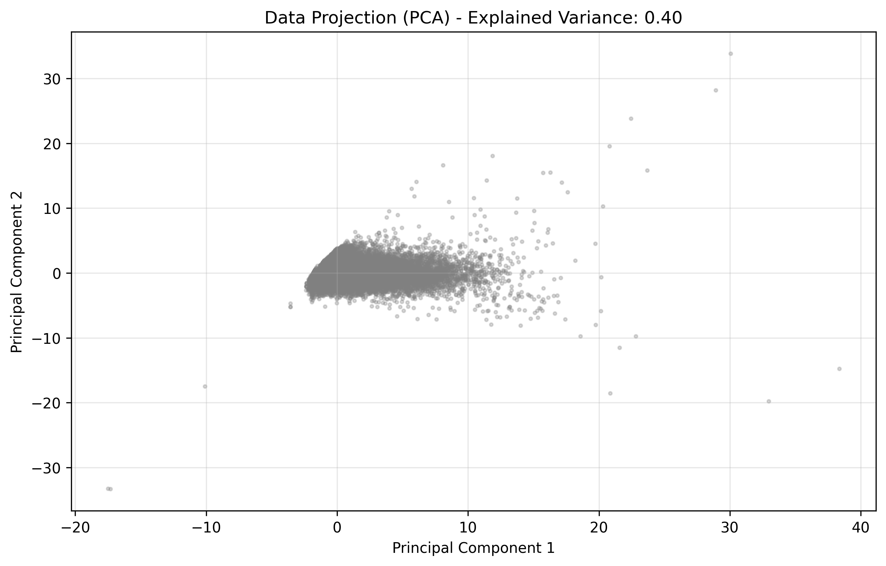
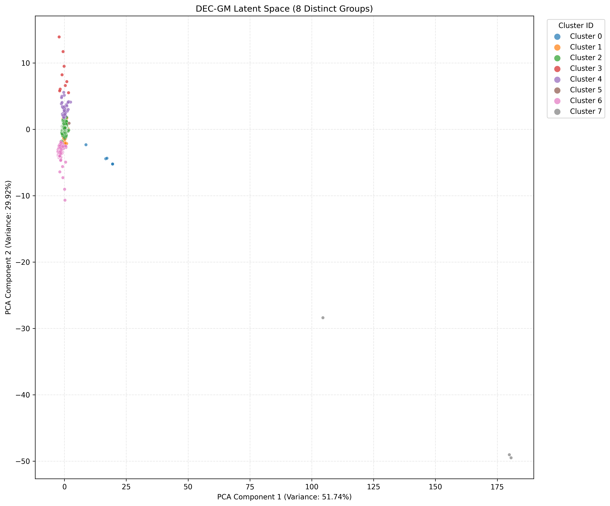
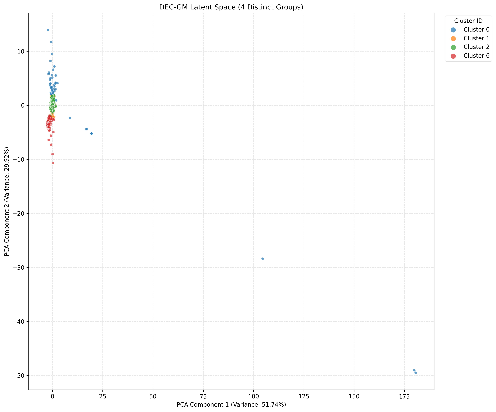
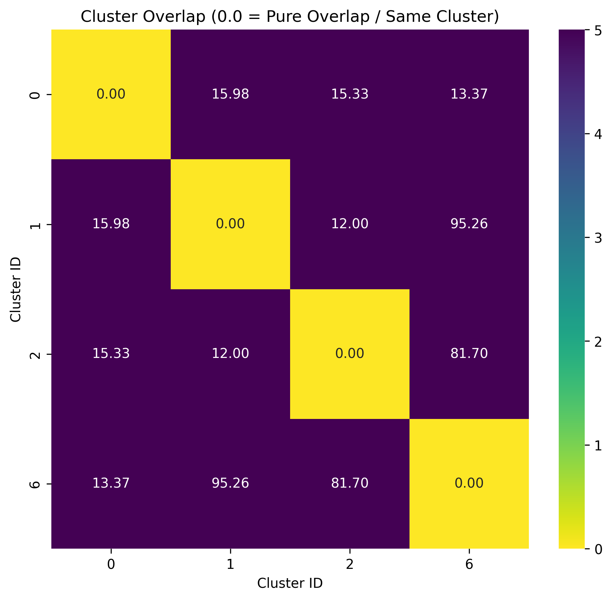
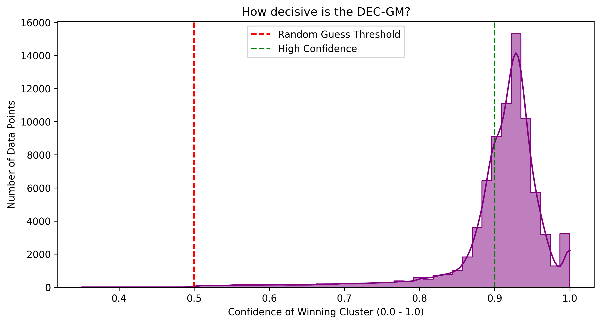
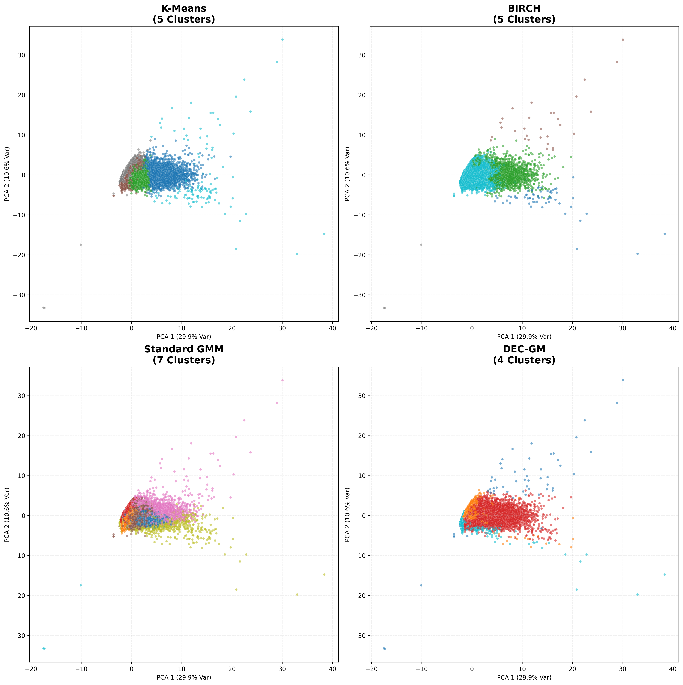
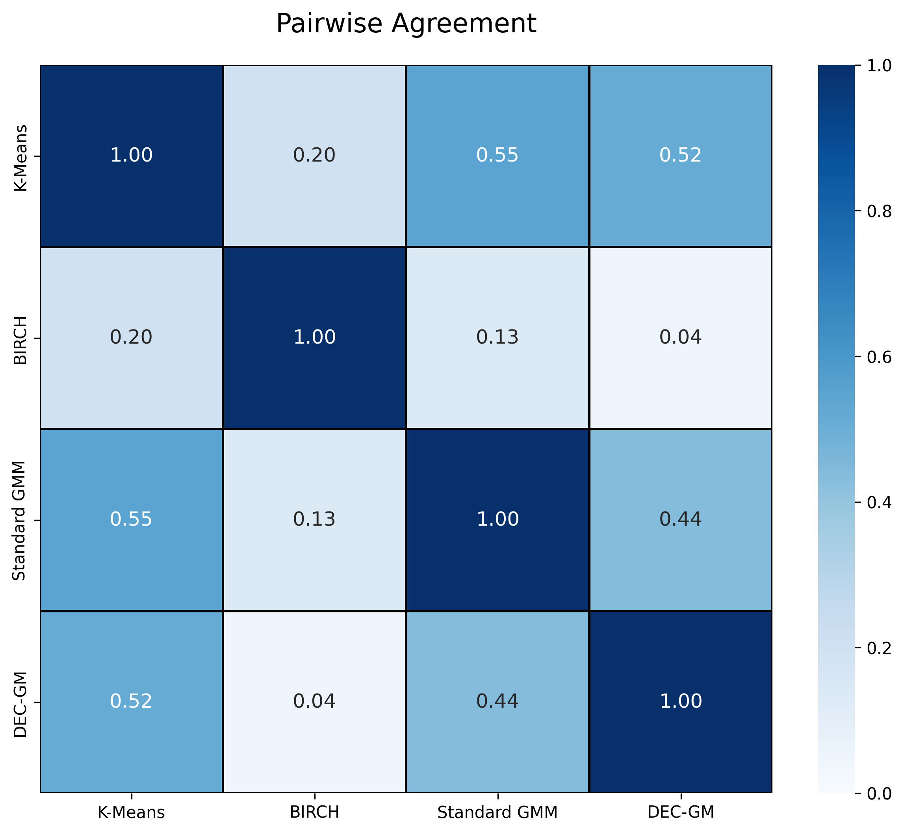

# AS-clustering
Repo for materials related to a clustering project for my dissertation
# AS Network Clustering with Deep Learning

This project explores how deep learning can be used to cluster Autonomous Systems (ASes) and better understand the structure of the internet. Rather than relying on manually labeled data or traditional distance-based clustering methods alone, it uses an Autoencoder combined with a Gaussian Mixture Model (DEC-GM) to uncover natural groupings in BGP and routing data.

The repository includes the full workflow: data preprocessing, model training, clustering evaluation, visualization tools, and route analysis utilities. It also comes with a cleaned dataset of roughly 78,000 ASNs and pretrained model weights so the results can be reproduced without retraining the network from scratch.

---

# Repository Contents

- **as_cluster.ipynb**  
  Main notebook containing the entire pipeline:
  - data preprocessing
  - model training in PyTorch
  - Optuna hyperparameter optimization
  - clustering evaluation
  - traceroute and route analysis tools

- **final_dataset_cleaned.csv**  
  Dataset containing 13 engineered routing and BGP-related features, including:
  - provider/customer relationships
  - IP address space
  - peering ratios
  - topology-related metrics

- **optuna_models/**  
  Pretrained `.pth` model weights that allow the training stage to be skipped.

---

# Architecture and Methodology

The project moves beyond standard clustering approaches such as K-Means by using a DEC-GM architecture implemented in PyTorch.

The model first compresses high-dimensional routing data into an 8-dimensional latent representation using an autoencoder. A Gaussian Mixture layer is then applied in the latent space to assign clusters probabilistically by minimizing Negative Log-Likelihood (NLL).

Hyperparameter tuning is handled with Optuna, which optimizes the balance between:
- reconstruction quality
- cluster separation
- entropy regularization

This produces clusters that are both distinct and structurally meaningful while avoiding unstable or fragmented partitions.

---

# Dataset Construction

A realistic view of the Autonomous System ecosystem cannot be captured from a single data source. Instead, the dataset is built through a multi-source aggregation pipeline designed to reflect three key aspects of each AS: topology, infrastructure, and security posture.

## Data Construction Pipeline

### Base Topology
The CAIDA AS-Relationships dataset is used as the structural backbone of the graph. It defines global provider–customer and peering relationships between Autonomous Systems.

During this stage, non-operational or "ghost" ASNs (registered networks that do not actively participate in routing) are filtered out to ensure only active infrastructure is retained.

### Network Maturity
Network registration data is collected from regional Internet registries (RIPE NCC, ARIN, APNIC, etc.).  
AS registration age is used as a proxy for operational maturity and long-term stability.

### Scale and Capacity
BGP routing tables from RouteViews are used to map advertised IP prefixes to their corresponding ASNs.

This provides an estimate of:
- network size
- address space ownership
- routing footprint

### Infrastructure and Security Signals
PeeringDB is integrated to capture physical infrastructure characteristics such as data center presence and Internet Exchange Point (IXP) connectivity.

Additionally, ASNs are cross-referenced with the Spamhaus DROP list to introduce binary security indicators for networks associated with malicious or abusive activity (e.g., spam or cybercrime infrastructure).

---

## Final Output

The result is a cleaned, multi-dimensional feature space that combines structural, operational, and security-related attributes. This dataset is then used as the input for downstream unsupervised learning and clustering models.

---

# Traceroute and Route Analysis

The notebook includes an `analyze_route` utility for working with real traceroute data. It takes a list of IP addresses from traceroute.

The function:
1. parses IP list text files
2. maps each hop to its corresponding ASN
3. determines the DEC-GM cluster assignment
4. outputs prediction entropy for each hop

This makes it possible to observe how traffic traverses different network tiers and organizational structures across the internet.

---

# Visualizations

Several visualization tools are included to help interpret both the latent space and the clustering results:

## PCA Projection of the Dataset



2D PCA projection of the AS feature space before clustering.

---

## Raw DEC-GM Cluster Assignments



Initial probabilistic cluster assignments produced directly by the DEC-GM latent space.

---

## Cleaned Operational Tiers



Final operational tiers after automatic cleanup and edge-case cluster merging.

---

## Cluster Overlap Analysis



Bhattacharyya-distance analysis showing probabilistic overlap and separability between clusters.

---

## Confidence Distribution



Prediction confidence (entropy/probability) distribution for DEC-GM cluster assignments.

---

## Model Comparison



Spatial comparison between the four final clustering approaches evaluated in the project.

---

## Pairwise Model Agreement



Agreement matrix comparing consistency between clustering algorithms across the AS dataset.

---

# Setup and Usage

Built with:
- Python 3.13
- PyTorch
- pandas
- scikit-learn
- matplotlib
- Optuna
- HDBSCAN

Run the notebook from top to bottom to execute the full pipeline:

```bash
jupyter notebook as_cluster.ipynb
```
Take care when running the notebook like this, as it can lead to unexpected outcomes. It is recommended to run the notebook cell by cell and analyze the outputs before proceeding.
